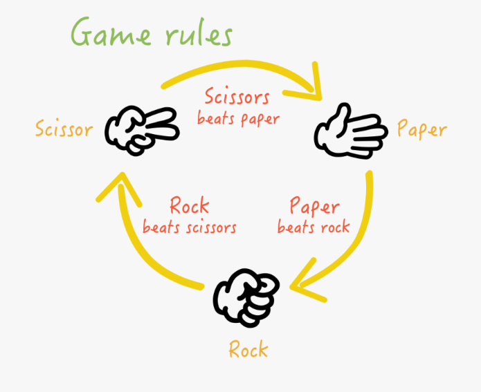
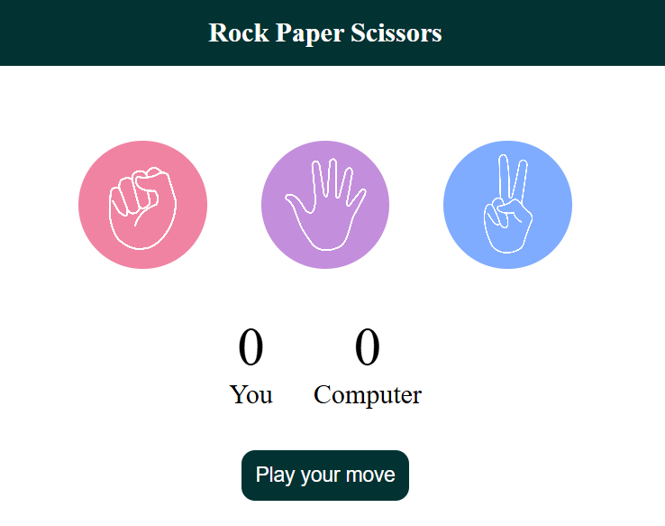

# Rock Paper and Scissor Game using JavaScript

**Rock, paper, and scissors** game is a simple fun game in which both players have to make a rock, paper, or scissors. It has only two possible outcomes a draw or a win for one player and a loss for the other player.

# Game Play

The players may count aloud to three, or speak the name of the game (e.g. "Rock! Paper! Scissors!"), either raising one hand in a fist and swinging it down with each syllable or holding it behind their back. They then "throw" by extending it towards their opponent. Variations include a version where players throw immediately on the third count (thus throwing on the count of "Scissors!"), or a version where they shake their hands three times before "throwing". We are going to computerize this game play, so that computer will choose some random choice while the player will have the choice to choose one [Rock! Paper! or Scissors!]

# Rules
A player who decides to play rock will beat another player who has chosen scissors ("rock crushes scissors" or sometimes "blunts scissors"), but will lose to one who has played paper ("paper covers rock"); a play of paper will lose to a play of scissors ("scissors cuts paper"). If both players choose the same shape, the game is tied and is usually immediately replayed to break the tie.

\

#### Possible cases are -

1. if (player == rock) and (computer == scissors); player wins

2. if (player == paper) and (computer == rock); player wins

3. if (player == scissors) and (computer == paper); player wins 

4. if (player == rock) and (computer == paper); computer wins

5. if (player == paper) and (computer == scissors); computer wins

6. if (player == scissors) and (computer == rock); computer wins

7. if (player == rock) and (computer == rock); tie

8. if (player == paper) and (computer == paper); tie

9. if (player == scissors) and (computer == scissors); tie

# Dependencies

* HTML
* CSS
* JavaScript

# Game OutLook

